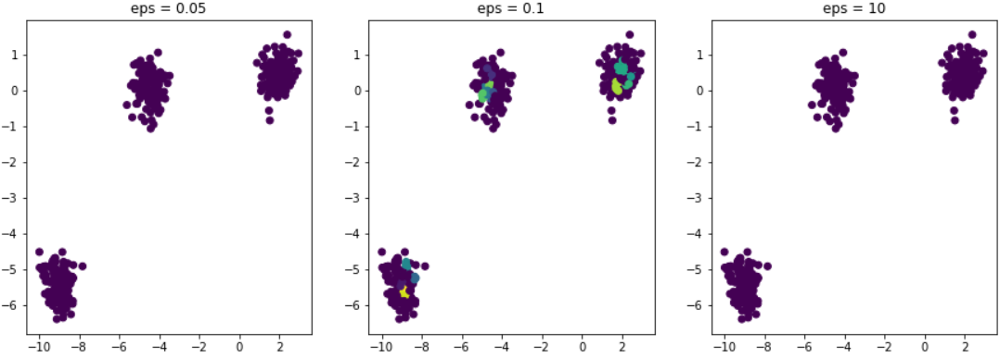

# customer-personality-analysis

# Veille sur la classification non supervisée  
## Introduction  
### Présentation du projet  
Ce projet, que nous réalisons en trio, va nous permettre de mettre en oeuvre des algorithmes de Classification Non Supervisée. Pour cela, nous allons devoir réaliser un regroupement non supervisé de clients à partir des données d'une petite épicerie. Nous allons devoir appliquer trois algorithmes de classification non supervisée différents afin de déterminer lequel s'applique au mieu à notre de jeu de données, que nous aurons préalablement nettoyées et préparées.  

### Contexte  
L'analyse de la personnalité du client est une analyse détaillée d’un groupe de clients idéaux pour une entreprise. Cela aide les entreprises à mieux comprendre leur clientèle et leur permet de modifier leurs produits ainsi que leurs
approches marketing de manière plus efficace et plus adaptée à leur clientèle.  
Cette analyse est très importante pour le développement d’une entreprise car elle se fait en fonction des besoins, des comportements et des préoccupations des différents types de segments de clients.  

### Déroulement  
Dans un premier temps, nous devons réaliser deux veilles:  
- La première sur les algorithmes de classification non supervisée. On doit apprendre au moins trois algorithmes différents.  
- La deuxième sur les méthodes de sélection du nombre optimal de clusters et la mesure de qualité d’un cluster.  

En suite, nous devons implémenter notre propre Class "K-means", ce qui veut dire que nous devons créer notre propre algorithme puis dans un second temps faire la même chose en appliquant la fonction K-means de Scikit-Learn au dataset Iris.  
Une fois que ceci est fait, nous devons lancer les modèles plusieurs fois et pour plusieurs valeurs de k. En suite, nous devons évaluer le nombre optimal de clusters ainsi que leur qualité.  

Une fois que tout ceci est fait, nous pouvons passer aux données de l'épicerie de notre quartier. Nous devorns donc:  
- Explorer et analyser les données  
- Nettoyer et pré-traiter les données  
- Réaliser une réduction de dimension à l’aide de la sélection de feature et/ou l'analyse à facteurs multiples  
- Appliquer trois algorithmes de Classification Non Supervisée  
- Comparer les résultats et évaluer les modèles  
- Définir ce qui caractérise les individus de chaque groupe  
- Conclure sur nos résultats.  

## Le jeu de données  
### Présentation des données  

### Préparation des données  

### Analyse des données  

## Les différents algorithmes de Classification Non Supervisée  
### Veille sur la Classification Non supervisée  
La classification à pour but de regrouper _n_ observations en un certains nombre de groupes ou de classes homogènes. Comme nous le savons déjà, il existe de types principaux de classification:  
- Supervisée  
- Non Supervisée  

Nous allons ici nous pencher sur la Classification Non Supervisée.  
En classification non supervisée, on ne connait pas le nombre de groupes qui existent dans la population, on ne connait pas le groupe auquel appartient chaque observation de la population et on veut classer les observations dans des groupes homogènes à partir de différentes variables.  
Parmi les applications typiques les plus connues on retrouve:  
- Biologie, pour l'élaboration de la taxonomie animale.  
- Psychologie, pour la détermination des types de personnalités présents dans un groupe d'individus.  
- Text Mining, pour le partitionnement de courriels ou textes en fonction du sujet traité.  

Il existe plusieurs familles de méthodes de classification non supervisée. Les plus communes sont:  

la classification hiérarchique;  
la classification non hiérarchique, par exemple la méthode des k-moyennes (k-means);  
la classification basée sur une densité;  
la classification basée sur des modèles statistiques/probabilistes, par exemple un mélange de lois normales.  

Pour regrouper des observations en groupes homogènes, il faut tout d’abord avoir une définition de ce que sont des observations similaires ou des observations différentes. Il faut donc être en mesure de quantifier la similarité ou la distance entre deux observations. Cette première étape peut parfois être la plus difficile de tout le processus de classification, mais elle est essentielle et est le premier pas de toute analyse de partitionnement.  

Si les observations sont constituées de _p_ nombres réels de valeurs du même ordre de grandeur, alors la distance euclidienne entre les deux vecteurs dans $\mathbb{R}^p$ est une mesure tout à fait raisonnable. Mais comment faire lorsque les observations sont constituées de _p_ variables binaires (oui/non, homme/femme...), ou _p_ variables catégorielles, des images, des textes où même un mélange de tout cela ?  
Plusieurs mesures ont été développées sur mesure pour leur application particulière à force d'expérience et expérimentation. C'est ce que nous allons voir dans la suite de cette veille.  

**Mesure de distance:**  
Une mesure de distance _d_ doit satisfaire les propriétés suivantes pour tout _i_, _j_, _k_ $\in$ {1, . . . , _n_}:  
- _d_(_i_, _j_) $\geq$ 0;  
- _d_(_i_, _j_) = 0;  
- _d_(_i_, _j_) = _d_(_j_, _i_);  
- _d_(_i_, _k_) $\leq$ _d_(_i_, _j_) + _d_(_j_, _k_).  

La distance $\lambda_q$ entre deux vecteurs dans $\mathbb{R}^p$ est définie par:  

$||x_i - x_j||_q = \left( \sum_{k=1}^p |x_{ik} - x_{jk}|^q \right)^{\frac{1}{q}}$

 
La distance euclidienne correspond au cas où q = 2.  

La distance $\lambda_q$ n'est pas invariante à un changement d'échelle.Ce qui a des conséquences majeures pour la pratique.  
Par exemple, considérons le jeu de données suivants:  
| Poids en grammes | Taille en centimètres |
| :- | -: |
| 10 | 7 |
| 20 | 2 |
| 30 | 10 |  

On trouve les distances suivantes:  
_d_(1, 2) = 11.2, _d_(1,3) = 20.2, _d_(2,3) = 12.8  

Si la taille est exprimée en millimètres, on trouve les distances suivantes:  
_d_(1, 2) = 51.0, _d_(1,3) = 36.1, _d_(2,3) = 80.6  

On peut donc se demander si le premier objet est plus près du deuxième objet ou du troisième objet ?  
Cet exemple explique pourquoi dans plusieurs situations on préfère travailler avec la distance standardisée entre les variables,  

$$
d^2(x_i, x_j) = \sum_{k=1}^p \left(\frac{x_{ik} - \mu_k}{s_k} - \frac{x_{jk} - \mu_k}{s_k}\right)^2 = \sum_{k=1}^p \left(\frac{x_{ik} - x_{jk}}{s_k}\right)^2
$$

Où  

$µ_k$ = moyenne de la variable k; $s_k$ = écart type de la variable k.  

On trouve les distances suivantes, peu importe l'unité de mesure utilisée:  
_d_(1, 2) = 16, _d_(1, 3) = 42, _d_(2, 3) = 26.  

**Indices de similarité**  
Un indice de similarité _s_ entre des objets doit satisfaire les propriétés suivantes pour tout _i_, _j_, _k_ $\in$ {1, . . . , _n_}:  
- 0 $\leq$ _s_(_i_, _j_) $\leq$ 1;  
- _s_(_i_, _j_) = _s_(_j_, _i_);  
- _s_(_i_, _i_) = 1.  

Une distance peut se transformer en similarité en posant  
_s_(_i_, _j_) = $\frac{1}{1 + d(_i_, _j_)}$.  

La relation inverse n'est pas vraie en raison de l'inégalité du triangle. On peut aussi définir la dissemblance entre deux objets, soit:  

_d_*(_i_, _j_) = 1 - _s_(_i_, _j_).  

L'indice de similarité dépend du ou des types de variables utilisées dans l'analyse. Les principaux types de variables avec lesquels on doit composer sont les suivants:  
- *Variables numériques*  
    Il s’agit de variables dont la valeur numérique mesure quelque chose de quantifiable et dont la différence entre les valeurs reflète la différence entre les objets. On peut ainsi parler du revenu en dollars, de la masse, de l’âge, etc.
    Pour ce type de variable, on utilise généralement la distance euclidienne standardisée.  

- *Variables nominales*  
    Les variables nominales (ou qualitative) peuvent être binaires (deux modalités) ou polytomique (plus de deux modalités). Dans les deux cas, elles peuvent être symétriques ou asymétriques.

    Les variables nominales symétriques sont des variables qualitatives (donc qui ne sont ni numériques ni ordinales) dont toutes les modalités sont aussi informatives l’une que l’autre. On peut penser par exemple au sexe (homme ou femme), à laquelle de l’une de 4 sections d’un cours des étudiants appartiennent, etc.

    Les variables nominales asymétriques sont des variables qualitatives dont les modalités ne contiennent pas toutes le même niveau d’information. Ceci se produit habituellement lorsque l’une des modalités est très fréquente, un peu la modalité par défaut, mais que les autres ne le sont pas. Par exemple si une variable indique si un individu est daltonien ou pas, deux individus daltoniens ont quelque chose en commun, mais deux individus non daltoniens n’ont pas nécessairement quelque chose en commun. Un autre exemple pourrait être si une transaction est frauduleuse ou pas dans une analyse où une très faible proportion des transactions sont frauduleuses.  

- *Variables nominales binaires*  
    Pour des vecteurs de variables binaires symétriques, on utilise la proportion d’accords (matching coefficient) dans les éléments des vecteurs. On commence par coder l’une modalité à 0 et l’autre à 1. Si on mesure _p_ variables binaires pour chacun de deux individus _i_ et _j_, on compte le nombre de variables pour lesquelles ces deux individus ont la même valeur pour une même variable, soit:  
    _m_ = $\sum_{k=1}^p I(x_ik = x_jk)$ et la similarité est définie par _s_(_i_, _j_) = _m_ / _p_. Par exemple supposons que deux individus remplissent un questionnaire de 10 questions et que la valeur 1 représente une réponse _OUI_ et 0 représent une réponse _NON_  

| Individu | Q1 | Q2 | Q3 | Q4 | Q5 | Q6 | Q7 | Q8 | Q9 | Q10 |
| -------- | -- | -- | -- | -- | -- | -- | -- | -- | -- | --- |
| i        | 1  | 0  | 0  | 0  | 0  | 1  | 0  | 0  | 0  | 0   |
| j        | 1  | 0  | 0  | 0  | 0  | 0  | 1  | 0  | 0  | 0   |

Alors si la similarité entre $x_i$ et $x_j$ ici serait _s_(_i_, _j_) = 8/10 = 0.8, puisqu'ils ont donné la même réponse pour 8 des 10 questions.  
Pour des vecteurs de variables binaires asymétriques, on assigne la modalité 1 à la valeur la plus rare (ou la plus importante) et la vameur 0 à l'autre modalité. Puis on peut utiliser l'indice de Jaccard défini par le nombre de variables pour lesquelles _i_ et _j_ prennent simultanément la valeur 1 sur le nombre de variables pour lesquelles au moins l'un de _i_ ou de _j_ n'a pas la valeur 0 soit:  
$J(i, j) = \frac{\sum_{k=1}^p x_ik x_jk}{\sum_{k=1}^p \{1 - (1 - x_ik)(1 - x_jk)}}$.  

Dans l'exemple ci-dessus on aurait donc _J_(_i_, _j_) = 1/3 = 0.33 puisque les 7 questions pour lesquelles les deux individus donnent simultanément la valeur 0 ne sont pas comptées ni au numérateur, ni au dénominateur; pour les 3 questions qui comptent (Q1, Q6 et Q7), ils sont en accord 1 fois, d’où le 1/3.  

- *Variables nominales polytomiques*  
    Si une variable est composée de _M_ > 2 modalités, on peut la coder en utilisant _M_ - 1 variables binaires. Par exemple si les réponses possibles à une question sont Oui, Non, Je Ne Sais Pas, on pourrait coder les trois réponses possible ainsi:  
    | Modalités | Individu 1 | Individu 2 |
    | :- | :-: | -: |
    | Oui | 1 | 0 |
    | Non | 0 | 1 |
    | Je Ne Sais Pas | 0 | 0 |  

    On peut en suite calculer la similarité entre _i_ et _j_ en utilisant les méthodes utilisées pour les variables binaires.  
    Si on a _q_ variables binaires ou polytomiques de même nature, il est d'usage de calculer la similarité séparemment pour chacune des _q_ variables puis de faire la moyenne des _q_ similarités.  
    Par exemple, supposons que nos deux individus _i_ et _j_ ont répondus à deux questions pour lesquelles ils avaient trois choix: _i_ répond _b_ aux deux questions alors que _j_ répond _b_ à la première et _c_ à la deuxième.  Supposons que les choix sont codés selon le tableau ci-dessous:  
    | Individu | Q1a | Q1b | Q1c | Q2a | Q2b | Q2c |
    | :- | :-: | :-: | :-: | :-: | :-: | -: |
    | i | 0 | 1 | 0 | 0 | 1 | 0 |
    | j | 0 | 1 | 0 | 0 | 0 | 1 |  

    Calculons les similarités pour chaque question en supposant les modalités aussi importantes les unes que les autres. On aura:   _s_$_Q1$(_i_, _j_) = 2/2 et _s_$_Q2$(_i_, _j_) = 1/2. En prenant la moyenne des deux similarités, on obtient  _s_(_i_, _j_) = {_s_$_Q1$(_i_, _j_) + _s_$_Q2$(_i_, _j_)} / 2 = 3/4.  

    Maintenant supposons que les variables correspondant à la question 1 sont symétriques et celles correspondant à la question 2 sont asymétriques. La similarité _s_$_Q1$(_i_, _j_) = 2/2 demeure inchangée puisqu'on conserve la même règle. Pour la deuxième question, on prend maintenant l'indice de Jaccard et donc _s_$_Q2$(_i_, _j_) = 0/1 car Q2a ne contribue pas au calcul. On obtient donc _s_(_i_, _j_) = {2/2 + 0/1} /2 = 1/2.  

- *Variables ordinales*  
    Il s’agit de variables qui ne donnent pas une quantification précise d’un phénomène, mais dont les modalités peuvent être naturellement ordonnées. On peut penser par exemple à un revenu faible, moyen ou élevé, ou à un niveau d’accord entre tout à fait en désaccord, en désaccord, pas d’avis, d’accord, tout à fait d’accord.

    On assigne habituellement un score numérique à chaque modalité de la variable ordinale, ensuite on la traite comme une variable numérique.

    Il n’y a pas de règle sur les scores numériques à donner, à part qu’ils doivent être positifs et refléter l’ordre des modalités. Par exemple pour une question sur le revenu, on pourrait accorder respectivement des scores de 1, 2, 3 pour des revenus faible, moyen, élevé, ou on pourrait aussi accorder 15000, 50000, 150000; c’est un exercice de jugement et il n’existe pas de règle mathématique claire.

*Observation constituée de plusieurs types de variables*  
Que doit-on faire si chaque observation est constituée de variables de plusieurs types, par exemple si pour chacun des  
n individus nous mesurons l’âge (numérique), le sexe (nominale symétrique), s’il est porteur d’une mutation génétique rare (nominale asymétrique) et son niveau d’accord avec une certaine politique (ordinale)? Il existe quelques façons de procéder, mais la plus commune semble être de mesurer la similarité de Gower.

On doit tout d'abord recoder toute variable nominale sous forme de variables binaires et toute variable ordinale sous forme de variable numérique et supposons qu'une fois cette opération éffectuée, on obtient _p_ variables par individu. La similarité de Gower entre $x_i$ et $x_j$ est définie ainsi:  

$$
    G(i, j) = \frac{\sum_{k=1}^p w_k \gamma_k(i, j) s_k(i, j)}{\sum_{k=1}^p w_k \gamma_k(i, j)}
$$

où $w_k$ est un poids accordé à la variable _k_ et $\gamma_k(i, j)$ et $s_k(i,j)$ sont définies directement selon le type de la variable _k_.  

Il est fortement recommandé de standardiser les variables numériques/ordinales au préalable. Les poids _w_ et _k_ permettent de moduler l’importance de chaque variable dans la mesure de similarité.

Si on poursuit avec notre exemple, supposons que nous avons recodé les réponses de nos individus _i_ et _j_
de sorte que la variable 1 est numérique, la variable 2 est ordinale, les variables 3 et 4 sont des indicatrices binaires correspondant à une variable symétrique et la variable 5 est une indicatrice correspondant à une variable asymétrique. Les valeurs pour les variables 1 et 2 ont été standardisées et supposons qu’elles prennent des valeurs entre -2.5 et 2.5 (donc une étendue de 5).  

| Individu | Q1 | Q2 | Q3 | Q4 | Q5 |
| -------- | -- | -- | -- | -- | -- |
| i        | 1  | 2  | 0  | 1  | 0  |
| j        | -1 | 1  | 0  | 0  | 1  |
 

Supposons que nous voulons que la question 1 soit trois fois plus importante que les autres dans la mesure de similarité; il faut lui accorder un poids $w_1$ qui est trois fois plus élevé que $w_2 = w_3 = w_4 = w_5 = 1$. On a:  
$\gamma_1(i, j) = \gamma_2(i, j) = \gamma_3(i, j) = \gamma_4(i, j) = 1$  
$\gamma_5(i, j) = 1 - (1 - x_i5)(1 - x_j5) = 1 - (1 - 1)(1 - 0) = 1$  

**Utilisation des méthodes factorielles**  
Les techniques de réduction de la dimension vues aux chapitres précédents peuvent aussi être utilisées pour simplifier le calcul des similarités/distances entre les observations. Par exemple si on a _p_ variables numériques/ordinales et que _p_ est une très grande valeur, on peut utiliser l’analyse en composantes principales pour calculer les scores de chaque observation dans les _k_ $\ll$ _p_ axes principaux.  
On utilise ensuite ces _k_ scores et la distance euclidienne pour calculer la distance entre les objets. Si on a plutôt _Q_ réponses à un questionnaire à choix multiples (ou plus généralement la valeur de _Q_ variables catégorielles), on peut calculer les scores de chaque observation dans les _k_ premiers axes principaux d’une analyse des correspondances multiples, ensuite encore une fois utiliser ces _k_ scores et la distance euclidienne pour calculer les distances.  

Nous allons maintenant voir trois algorithmes différents s'appliquant à la Classification Non Supervisée.  

### K-Means  
La méthode des K-moyennes s'applique à des situations où les _p_ variables sont numériques/ordinales (et habituellement standardisée). L'objectif de la méthode est de partitionner les données en _K_ groupes et la valeur de _K_ est fixée. L'algorithme est relativement simple et on peut démontrer qu'à chaque étape de son exécution, la valeur de _W_(_C_) est diminuée.  
Concrètement, voici comment fonctionne l'algorithme étape par étape:  
1. On commence par choisir le nombre de groupes _K_ que l'on veut obtenir.  
2. On partitionne aléatoirement les _n_ observations en _K_ groupes.  
3. On calcule les coordonnées des centroïdes (le vecteur-moyenne) pour chacun des _K_ groupes, soit:  
$\mu_k = \frac{1}{N_k} \sum_{i:C(i) = k} x_i, \quad k = 1, \ldots, K$

Où $N_k$ est le nombre d'observations dans le groupe _k_.  

4. On calcule la distance entre chaque observation et chacun des _K_ vecteurs-moyennes.  
5. On assigne chacune des _n_ observations au groupe dont le vecteur-moyenne est le plus près.  
6. On répète les étapes 3 à 5 jusqu'à ce qu'aucune observation ne soit réassignée à un nouveau groupe.  

**Exemple d'utilisation de K-Means**  
Supposons les 5 observations des variables $x_1$ et $x_2$ suivantes:  
| i     | 1    | 2    | 3    | 4    | 5    |
| ----  | ---  | ---  | ---  | ---  | ---  |
| $x_{i1}$ | -1   | -0.5 | 0    | 0.5  | 1    |
| $x_{i2}$ | -1   | 0    | 0.5  | -0.5 | 1    |  

*Itération 1*  
1. On chisit K = 2  
2. On assigne les observations 1, 2, 5 au groupe 1. Les observations 3 et 4 sont assignées au groupe 2.  
3. On calcule les centroïdes des groupes:  
$$
\mu_1 = \frac{1}{3} \{\begin{pmatrix} -1 \\ -1 \end{pmatrix} + \begin{pmatrix} -0.5 \\ 0 \end{pmatrix} + \begin{pmatrix} 1 \\ 1 \end{pmatrix} \} = \begin{pmatrix} -1/6 \\ 0 \end{pmatrix}
$$  

$\mu_2 = \frac{1}{2} \{\begin{pmatrix} 0 \\ 0.5 \end{pmatrix} + \begin{pmatrix} 0.5 \\ -0.5 \end{pmatrix}\} = \begin{pmatrix} 1/4 \\ 0 \end{pmatrix}$.  

4. On calcule la distance entre chaque observations et chacun des _K_ centroïdes.  
| i     | 1    | 2    | 3    | 4    | 5    |
| ----  | ---  | ---  | ---  | ---  | ---  |
| $d^2(i, \mu_1)$ | 1.69   | 0.11 | 0.28    | 0.69  | 2.36    |
| $d^2(i, \mu_2)$ | 2.56   | 0.56    | 0.31  | 0.31 | 1.57    |  

5. On assigne chacune des _n_ observations au groupe dont le centroïde est le plus près. Dans ce cas-ci, les observations 1,2 et 3 sont assignées au groupe 1 et les observations 4 et 5 sont assignées au groupe 2.  

*Itération 2*  
3. On calcule les centroïdes des groupes:  
$\mu_1 = \frac{1}{3} \{\begin{pmatrix} -1 \\ -1 \end{pmatrix} + \begin{pmatrix} -0.5 \\ 0 \end{pmatrix} + \begin{pmatrix} 0 \\ 0.5 \end{pmatrix} \} = \begin{pmatrix} -1/2 \\ -1/6 \end{pmatrix}$  

$\mu_2 = \frac{1}{2} \{\begin{pmatrix} 0.5 \\ -0.5 \end{pmatrix} + \begin{pmatrix} 1 \\ 1 \end{pmatrix}\} = \begin{pmatrix} 3/4 \\ 1/4 \end{pmatrix}$.  

4. On calcule la distance entre chaque observations et chacun des _K_ centroïdes.  
| i     | 1    | 2    | 3    | 4    | 5    |
| ----  | ---  | ---  | ---  | ---  | ---  |
| $d^2(i, \mu_1)$ | 0.94   | 0.03 | {0.69}    | 1.11  | 3.61    |
| $d^2(i, \mu_2)$ | 4.63   | 1.63    | 0.63  | 0.63 | 0.63    |   

5. On assigne chacune des _n_ observations au groupe dont le centroïde est le plus près. L’observation 3 passe du groupe 1 au groupe 2.  

*Itération 3*  
3. On calcule les centroïdes des nouveaux groupes.  
$\mu_1 = \frac{1}{2} \{\begin{pmatrix} -1 \\ -1 \end{pmatrix} + \begin{pmatrix} -0.5 \\ 0 \end{pmatrix} \} = \begin{pmatrix} -3/4 \\ -1/2 \end{pmatrix}$  

$\mu_2 = \frac{1}{3} \{\begin{pmatrix} 0 \\ 0.5 \end{pmatrix} + \begin{pmatrix} 0.5 \\ -0.5 \end{pmatrix} + \begin{pmatrix} 1 \\ 1 \} = \begin{pmatrix} 1/2 \\ 1/3 \end{pmatrix}$.  

4. On calcule la distance entre chaque observation et chacun des _K_ centroïdes.  
| i     | 1    | 2    | 3    | 4    | 5    |
| ----  | ---  | ---  | ---  | ---  | ---  |
| $d^2(i, \mu_1)$ | 0.31   | 0.31 | {1.56}    | 1.56  | 5.31    |
| $d^2(i, \mu_2)$ | 4.03   | 1.11    | 0.28  | 0.69 | 0.69    |  

5. On assigne chacune des _n_ observations au groupe dont le centroïde est le plus près. Toutes les observations sont déjà dans le groupe dont le centroïde est le plus près. Il n’y a aucun changement. L’algorithme est terminé.

### Classification Hiérarchique  
Si on ne sait pas quelle valeur de _K_ utiliser ou si les observations ne sont pas constituées de variables numériques ou ordinales, la méthode des k-moyennes ne s’applique pas (il faut une distance en bonne et due forme pour que les assignations aux groupes via les distances à un vecteur-moyenne aient du sens). On peut alors utiliser un des nombreux algorithmes de classification hiérarchique. La classification hiérarchique permet d’obtenir des partitions tout imbriquées les unes dans les autres. Il existe deux types d’algorithmes pour effectuer de la classification hiérarchique:  
- Les algorithmes ascendants
- Les algorithmes descendants  

L’exécution d’un tel algorithme ne donne pas une seule partition, mais _n_ partitions: une partition avec un groupe, une partition avec deux groupes, …, une partition avec _n_ groupes. Nous verrons plus tard comment résumer de façon visuelle le résultat d’une classification hiérarchique à l’aide d’un graphique en forme d’arbre appelé dendogramme. Nous verrons aussi des critères qui peuvent aider à choisir l’une parmi les _n_ partitions proposées par l’algorithme.

Un algorithme descendant fonctionne ainsi:  
- au départ toutes les observations sont dans un seul et même groupe de _n_ observations;  
- à chaque étape, on divise le groupe le moins homogène en deux groupes;  
- à la fin, après chaque _n_ étapes, chaque observation est son propre groupe, c'est-à-dire qu'on obtient _n_ groupes contenant une seule observation.  

Un algorithme ascendant fonctionne à l'inverse:  
- au départ chaque observation est son propre groupe, c'est-à-dire qu'on démarre avec _n_ groupes contenant chacun une seule observation;  
- à chaque étape, on fusionne les deux groupes les plus similaires;  
- à la fin des _n_ étapes, on obtient un seul groupe contenant toutes les _n_ observations.  

Comme les algorithmes descendants demandent beaucoup de temps de calcul (ce n’est pas tout de déterminer quel groupe scinder en 2, mais on doit déterminer comment ce découpage doit se faire) et qu’ils sont peu utilisés en pratique, nous nous concentrerons sur les algorithmes ascendants.  

**Algorithmes ascendants**  
Les implémentations de la classification hiérarchique se distinguent de deux manières:  
- leur façon de mesurer les distances ou les similarités entre deux observations;  
- leur façon de mesurer les distances ou les similarités entre deux groupes.  

Pour réaliser les algorithmes mentionnés précedemment, on doit définir _d_(_A_, _B_), la distance entre deux groupes d'observations _A_ et _B_ tels que:  
- les groupes _A_ et _B_ sont des sous-ensembles des observations du jeu de données;  
- l'intersection entre les groupes _A_ et _B_ est l'ensemble vide.  

Nous avons vu toutes sortes de méthodes pour calculer la distance entre une paire d’observations, mais nous devons maintenant considérer des méthodes pour calculer la distance entre une paire de groupes d’observations. Il existe plusieurs façons de calculer une telle distance entre deux groupes lors de l’exécution d’une classification hiérarchique ascendante. Voici une petite liste explicative de certaines d'entre elles:  

*Méthode du plus proche voisin (single linkage)*  
La distance entre deux groupes se définit comme suit pour cette méthode:  
_d_(_A_, _B_) = min $ \{ d_ij : i \in A, j \in B \}$.  

Si on travaille avec des indices de similarité alors on pose:  
_s_(_A_, _B_) = max $\{ s_ij : i \in A, j \in B \}$.  

On voit donc d’où la méthode tire son nom: la distance/similarité entre deux groupes d’observations est tout simplement la distance/similarité entre les points de chaque groupe qui sont les plus rapprochés/similaires.  

*Méthode du voisin le plus distant (complete linkage)*  
La distance entre deux groupes se définit comme suit pour cette méthode:  
_d_(_A_, _B_) = max $\{ d_ij : i \in A, j \in B \}$.  

Si on travaille avec les indices de similarité alors on aura:  
_s_(_A_, _B_) = min $\{ s_ij : i \in A, j \in B \}$.  

Encore une fois comme le nom l’indique, la distance/similarité entre deux groupes d’observations est tout simplement la distance/similarité entre les points de chaque groupe qui sont les plus éloignés/dissimilaires.  

Cette méthode est peu utilisée en pratique.  

*Méthode de la moyenne (average linkage)*  
La distance entre deux groupes se définit comme suit pour cette méthode:  
_d_(_A_, _B_) = $\frac{1}{n_a n_b} \sum_{i}\in A \sum_{j}\in B d(x_i, x_j)$,  

où $n_a$ est le nombre d'observations dans le groupe A et $n_b$ est le nombre d'observations dans le groupe B.  

On doit donc calculer $n_a x n_b$ distances possibles entre les points des deux groupes, en suite on prend la moyenne de ces distances comme étant celle qui sépare les deux groupes.  

La méthode de la moyenne forme des groupes de faibles variance et de même variance.  

*La méthode du centroïde*  
La distance entre deux groupes se définit comme suit pour cette méthode:  
_d_(_A_, _B_) = $d(\bar{x_A}, \bar{x_B})$,  

où  

$\bar{x_A} = \frac{1}{n_A} \sum_{i \in A} x_i, \bar{x_B} = \frac{1}{n_B} \sum_{j \in B} x_j$.  

La moyenne $\bar{x_AB}$ du nouveau groupe résultant de la fusion des groupes A et B se calcule comme suit:  
$\bar{x_AB} = \frac{n_A \bar{x_A} + n_B \bar{x_B}}{n_A + n_B}$.  

*Méthode de la médiane*  
A une étape donnée, nous avons toujours à notre disposition la distance entre les groupes déjà formés. On fusionne les deux groupes les plus similaires, dison _A_ et _B_ pour obtenir un groupe _AB_. Avec la méthode de la médiane, la distance entre le nouveau groupe _AB_ et tout autre groupe _C_ est définit par:  

_d_(_AB_, _C_) = $\frac {d(A, C) + d(B, C)}{2} - d(A, B) / 4$.  

### DBSCAN (Density-Based Spatial Clustering of Applications with Noise)  
Etant donnés des points et un entier _k_, l'algorithme vise à diviser les points en _k_ groupes appelés clusters, homogènes et compacts.  

le DBSCAN est un algorithme simple qui définit des clusters en utilisant l'estimation de la densité locale. On peut le diviser en 4 étapes:  
- Pour chaque observation on regarde le nombre de points à au plus une distance $\varepsilon$ de celle-ci. On appelle cette zone le $\varepsilon$-voisinage de l'observation.  
- Si une observation compte au moins un certain nombre de voisins y compris elle-même, elle est considérée comme une observation cœur. On a alors décelé une observation à haute densité.  
- Toutes les observations au voisinage d’une observation cœur appartiennent au même cluster. Il peut y avoir des observations cœur proche les unes des autres. Par conséquent de proche en proche on obtient une longue séquence d’observations cœur qui constitue un unique cluster.  
- Toute observation qui n’est pas une observation cœur et qui ne comporte pas d’observation cœur dans son voisinage est considérée comme une anomalie.  

On a donc besoin de définir deux informations avant d'utiliser le DBSCAN:  
- Quelle distance $\varepsilon$ pour déterminer pour chaque observation le $\varepsilon$-voisinage ?  
- Quel est le nombre minimal de voisin nécessaire pour considérer qu'une observation est une observation coeur ?  

Ces deux informations sont renseignées librement par l'utilisateur. Contrairement à l'algorithme des k-means ou la classification ascendante hiérarchique, il n'y a pas besoin de définir en amont le nombre de clusters ce qui rend l'algorithme moins rigide.  

*Notion de distance et choix du $\varepsilon$*  
Dans cet algorithme il y a deux points clés:  
- Quelle est la métrique utilisée pour évaluer la distance entre une observation et ses voisins ?  
- Quel est le $\varepsilon$ idéal ?  

Avec le DBSCAN on utilise généralement la distance euclidienne, soit p = ($p_1$, . . ., $p_n$) et q = ($q_1$, . . ., $q_n$):  

_d_(p, q) = $\sqrt{(p_1 - q_1)² + (p_2 - q_2)² + . . . + (p_i - q_i)² + . . . + (p_n - q_n)²} = \sqrt{\sum_{i = 1}^n (p_i - q_i)²}$.  

A chaque observation, pour compter le nombre de voisin à au plus une distance $\varepsilon$, on calcule la distance euclidienne entre le voisin et l'observation et on vérifie si c'est inférieur à $\varepsilon$.  

Reste maintenant à savoir comment choisir le bon epsilon. Supposons que dans notre exemple nous choisissons de tester l’algorithme avec des valeurs différentes de $\varepsilon$ . Voici le résultat :  
.  

Dans les trois exemples le nombre de voisins minimal est toujours fixé à 5.  

Si $\varepsilon$ est trop petit le $\varepsilon$-voisinage est trop faible et toutes les observations du jeu de données sont considérées comme des anomalies.  

C’est le cas de la figure de gauche eps = 0.05. 

A contrario si $\varepsilon$ est trop grand chaque observation contient dans son $\varepsilon$-voisinage toutes les autres observations du jeu de données. Par conséquent nous n’obtenons qu’un unique cluster. Il est donc très important de bien calibrer le ε pour obtenir un partitionnement de qualité.  

Une méthode simple pour optimiser le $\varepsilon$ consiste à regarder pour chaque observation à quelle distance se situe son voisin le plus proche. Ensuite il suffit de fixer un $\varepsilon$ tel qu’une part « suffisamment grande » des observations aient une distance à son plus proche voisin inférieure à $\varepsilon$. Par « suffisamment grande » on entend 90-95% des observations qui doivent avoir au moins un voisin dans leur $\varepsilon$-voisinage.

## Les Clusters  
Dans le domaine de l'apprentissage non supervisé, une des principales étapes consiste à déterminer le nombre optimal de clusters et à évaluer la qualité des clusters obtenus. Les algorithmes de clustering, tels que K-means, nécessitent la spécification du nombre de clusters à l'avance, ce qui pose la question cruciale : comment choisir ce nombre de manière objective et justifiée ? De plus, une fois les clusters formés, il est essentiel de mesurer leur qualité pour s'assurer que les données ont été correctement partitionnées.

La sélection du nombre optimal de clusters est une tâche essentielle, car elle peut grandement influencer les résultats et les interprétations des analyses de clustering. Plusieurs méthodes ont été développées pour aider à cette sélection, chacune avec ses propres avantages et inconvénients. Parmi ces méthodes, la méthode du coude (Elbow Method), la méthode de la silhouette (Silhouette Method) et les critères d'information comme le BIC (Bayesian Information Criterion) et l'AIC (Akaike Information Criterion) sont les plus couramment utilisées.

Parallèlement, mesurer la qualité d’un cluster permet de valider et de comparer les résultats de différents algorithmes ou de différents paramètres. Les mesures de qualité de clusters peuvent se baser sur la cohésion intra-cluster, la séparation inter-cluster, ou des indices combinant ces deux aspects, comme le score de silhouette.

Nous allons donc voir les quatre méthodes de sélection énoncée ci-dessus puis apprendre comment on peut mesurer la qualité d'un cluster.  

### Méthodes de sélection du nombre optimal de clusters  
*Méthode du Coude*  
La méthode du coude se base sur le fait que la somme de la variance intraclusters peut être réduite grâce à l'augmentation du nombre de clusters. Plus il est élevé, plus il permet d'extraire des groupes plus fins à partir de l'analyse d'objets de données qui ont plus de similarité entre eux. On utilise le point de retournement de la courbe de la somme des variances pour choisir le bon nombre de clusters.

Voici comment fonctionne cette méthode:  
1. Exécution de l'algorithme de clustering pour un intervalle de valeurs de _K_ (par exemple, _K_ de 1 à 10).  
2. Calcul de l'inertie pour chaque valeur de _K_.  
3. Traçage de l'inertie en fonction de _K_.  
4. Identification du point de coude dans la courbe.  

*Méthode de la silhouhette*  
La méthode de la silhouette est une mesure de la qualité d'un clustering, qui évalue à la fois la cohésion intra-cluster et la séparation inter-cluster. Elle fournit une indication de la compacité des clusters ainsi que de leur séparation les uns par rapport aux autres. La silhouette est souvent utilisée pour déterminer le nombre optimal de clusters dans un ensemble de données.  
La silhouette pour un point de données mesure à quel point ce point est proche des autres points dans son propre cluster par rapport à la distance moyenne des points dans d'autres clusters. La silhouette est calculée pour chaque point de données et fournit une mesure globale de la qualité du clustering.  

_Calcul de la silhouette pour un point de données_:  
Pour un point de données _i_, la silhouette est calculée comme ceci:  
1. Cohésion Intra-Cluster ($a_i$): Calcul de la distance moyenne entre le point _i_ et tous les autres points du même cluster. Cela mesure à quel point le point _i_ est proche des autres points de son propre cluster.  

$a_i = \frac{1}{|C_i| - 1} \sum_{j \in C_i, j \neq i} d(i, j)$.  

Où $|C_i|$ est le nombre de points dans le cluster $C_i$, et _d_(_i_, _j_) est la distance entre les points _i_ et _j_.  

2. Séparation Inter-Cluster($b_i$): Pour chaque cluster différent de celui auquel appartient le point _i_ calculer la distance moyenne entre le point _i_ et tous les points de ce cluster. Sélectionner la distance moyenne minimale parmi ces clusters. Cela mesure à quel point le point _i_ est éloigné des points des autres clusters.  

$b_i = min_{k\neq C_i} \frac{1}{|C_k|} \sum_{j \in C_k} d(i, j)$.  

3. Silhouette ($s_i$): la silhouette pour le point _i_ est donnée par:  
$s_i = \frac{b_i - a_i}{max(a_i , b_i)}$.  

La valeur de la silhouette $s_i$ est comprise entre -1 et 1. Une valeur élevée de la silhouette indique que le point est bien classé, avec une cohésion intra-cluster élevée et une séparation inter-cluster élevée. Une valeur proche de 0 indique que le point est proche de la frontière entre deux clusters, tandis qu'une valeur négative indique que le point pourrait être mal classé.  

_Calcul de la silhouette moyenne_:  
La silhouette moyenne fournit une mesure globale de la qualité du clustering. Plus la silhouette moyenne est proche de 1, meilleure est la partition des clusters. Une valeur négative ou proche de zéro indique généralement une mauvaise séparation des clusters.  

*Bayesian Information Criterion (BIC)*  
Le critère d'information bayésien (BIC) est une mesure utilisée pour comparer différents modèles statistiques. Il est dérivé de la théorie de l'information et de l'approche bayésienne de l'inférence statistique. Le BIC est largement utilisé dans le contexte du clustering pour sélectionner le nombre optimal de clusters. Voici la formule d'utilisation:   

$BIC = k\log(N) - 2\log(L)$.  

Où:  
N est le nombre total d'observations dans l'ensemble de données.  
k est le nombre total de paramètres estimés dans le modèle, y compris les paramètres des clusters ainsi que les paramètres de variance.  
L est la fonction de vraisemblance maximale du modèle, qui mesure la probabilité des données observées sous le modèle.  

Le BIC favorise les modèles qui ajustent bien les données tout en étant parcimonieux en termes de nombre de paramètres. Plus le BIC est bas, meilleure est la qualité du modèle. Lors de la comparaison de plusieurs modèles de clustering avec des nombres de clusters différents, le modèle avec le BIC le plus bas est généralement choisi comme le meilleur modèle.  

*Akaike Information Criterion (AIC)*:  
Le critère d'information d'Akaike (AIC) est une autre mesure utilisée pour comparer la qualité de différents modèles statistiques. Il est similaire au BIC mais utilise une pénalité moins forte pour le nombre de paramètres du modèle. Comme le BIC, l'AIC est largement utilisé dans le contexte du clustering pour sélectionner le nombre optimal de clusters.  Voici la formule d'utilisation:  

$AIC = 2k - 2\log(L)$.  

Où _k_ et _L_ sont définis de la même manière que pour le BIC.  

Comme le BIC, l'AIC favorise les modèles qui ajustent bien les données tout en étant parcimonieux en termes de nombre de paramètres. Cependant, l'AIC peut être plus indulgent envers les modèles avec un nombre de paramètres plus élevé que le BIC. De même, lors de la comparaison de plusieurs modèles de clustering, le modèle avec le plus petit AIC est généralement considéré comme le meilleur. 

### Mesure de qualité d'un cluster  
La mesure de qualité d'un cluster est essentielle pour évaluer la pertinence et l'efficacité d'un algorithme de clustering dans la segmentation des données en groupes homogènes. Il existe plusieurs mesures de qualité qui peuvent être utilisées pour évaluer la cohérence et la séparation des clusters. Les mesures de qualité de clustering sont généralement divisées en deux catégories principales:  

1. Cohésion Intra-Cluster 
La cohésion intra-cluster évalue à quel point les membres d'un cluster sont similaires entre eux. Une cohésion élevée indique que les points dans le même cluster sont étroitement liés les uns aux autres.  

Parmi les différentes mesures on retrouve par exemple l'inertie:  
L'inertie est une mesure clé utilisée pour évaluer la qualité du clustering. Elle représente la somme des distances au carré entre chaque point de données et le centroïde de son cluster. Plus formellement, l'inertie est définie comme suit:  

$Inertie = \sum_{k=1}^K \sum_{i \in C_k} ||x_i - µ_k||²$.  

Où  

_K_ est le nombre de clusters.  
$C_k$ est le k-ième cluster.  
$x_i$ est un point de données appartenant au cluster $C_k$.  
$µ_k$ est le centroïde de $C_k$.  
$||x_i -µ_k||²$ est la distance au carré entre le point $x_i$ et le centroïde $µ_k$.  

L'inertie mesure donc la cohésion interne des clusters, c'est-à-dire la compacité des clusters formés. Un faible niveau d'inertie indique que les points sont proches de leurs centroïdes respectifs, ce qui suggère des clusters denses et bien définis.  

2. Séparation Inter-Cluster  
La séparation inter-cluster évalue à quel point les clusters sont distincts les uns des autres. Une séparation élevée indique que les clusters sont bien séparés et distincts les uns des autres.  

Parmi les différentes mesures on retrouve par exemple la mesure de Davies Bouldin:  
L'indice de Davies-Bouldin est une mesure de qualité utilisée pour évaluer la qualité d'un clustering en prenant en compte à la fois la cohésion intra-cluster et la séparation inter-cluster. Contrairement à d'autres mesures, comme l'inertie ou la silhouette, qui se concentrent sur un aspect spécifique du clustering, l'indice de Davies-Bouldin tente de fournir une mesure globale de la qualité en considérant à la fois la compacité des clusters et leur séparation.
L'indice de Davies-Bouldin pour un ensemble de clusters est défini comme la moyenne des indices de similarité de chaque cluster par rapport aux autres clusters. La formule générale pour calculer l'indice de Davies-Bouldin est la suivante:  

$DB = \frac{1}{K} \sum_{i=1}^K max_{j \neq i}(\frac{cohésion(i) + cohésion(j)}{séparation(i,j)})$.  

Où  

_K_ est le nombre de clusters.  
cohésion(i) est une mesure de la cohésion intra-cluster du cluster _i_ par exemple la dispersion moyenne des points par rapport à leur centroïde.  
séparation(i,j) est une mesure de la séparation inter-cluster entre les clusters _i_ et _j_ par exemple la distance entre leurs centroïdes.  

Un indice de Davies-Bouldin faible indique une meilleure séparation entre les clusters et une meilleure compacité intra-cluster. En d'autres termes, des valeurs faibles de l'indice de Davies-Bouldin indiquent un meilleur clustering, où les clusters sont bien séparés les uns des autres et où les points à l'intérieur de chaque cluster sont proches les uns des autres.

## Conclusion
