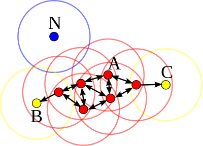
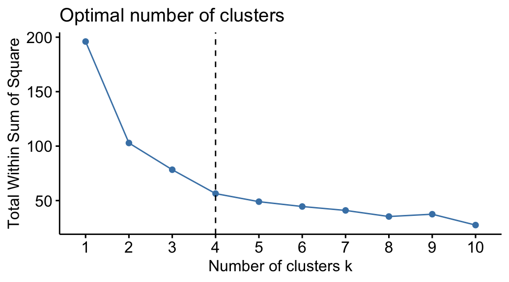
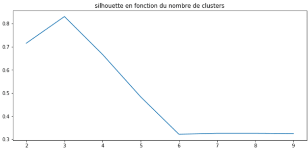
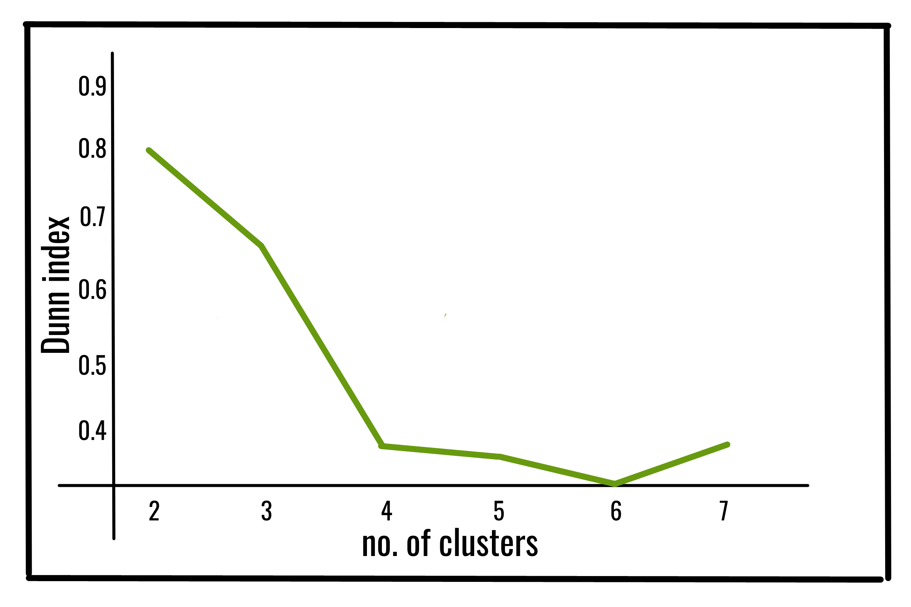
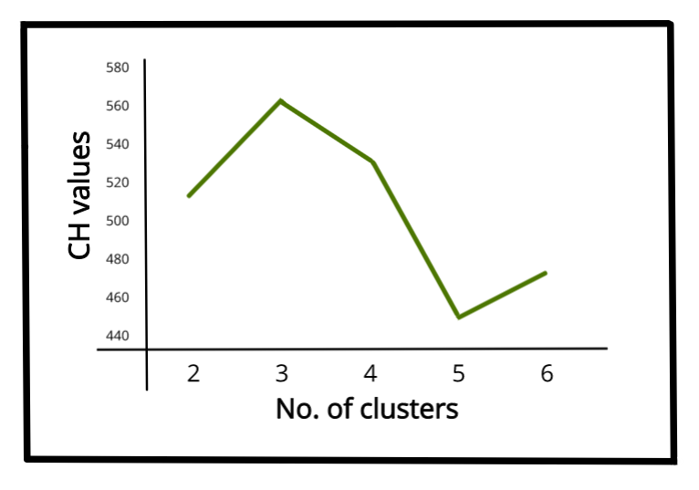

# customer-personality-analysis
Apprentissage et utilisation d'algorithmes de classifications non supervisées

## Contexte du projet

L'objectif de ce projet est de réaliser une analyse de la personnalité des clients d'un commerce de détail en utilisant des algorithmes de classifications non supervisées.   
Pour cela nous apprenons à utiliser des algorithmes de clustering tels que K-means, DBSCAN et le clustering hiérarchique, ainsi que les méthodes de sélection du nombre optimal de clusters et de validation des clusters.   

## Veille technologique sur les algorithmes de classifications non supervisées

### L'apprentissage non supervisé

L'apprentissage non supervisé est une méthode d'apprentissage automatique qui consiste à utiliser un ensemble de données non étiquetées pour trouver des similitudes et des différences entre les données sans intervention d'un supereviseur.   
L'objectif de cet apprentissage est de trouver des structures cachées dans les données.   
Ils sont utilisés dans de nombreux domaines, tels que la reconnaissance de formes, la segmentation d'images, la segmentation de texte, la recommandation de produits.

### Les principaux algorithmes de classifications non supervisées

#### 1. K-means

La méthode des K-moyennes, ou K-means clustering en anglais, est l'un des algorithmes de clustering les plus populaires.   
Il est utilisé pour partitionner un ensemble de données en K groupes, dans ce cas, K représente le nombre de groupes créés en fonction de la distance entre le noyau de chaques groupe.   
Ce noyau est aussi appelé centroïde et est soit choisi au hasard, soit spécifié par le data scientis, en fonction des données.  
Une fois que le nombre de groupes (K) et les centroïdes ont été définis, le modèle assigne chaque nouveau point au noyau le plus proche et le groupe dans un cluster correspondant.   
La méthode la plus répandue pour calculer la distance entre un point et un noyau est le carré de la distance Euclidienne.   
L'un des principaux inconvénients de cet algorithme est que le nombre de clusters doit être spécifié à l'avance, ce qui peut être difficile à déterminer dans certains cas.


#### 2. Clustering hiérarchique

Le clustering hiérarchique est une autre méthode de clustering qui créé une structure s'apparentant à un arbre.   
On appelle cet arbre un dendrogramme.   
Ce type de clustering peut être divisé en deux catégories: les classifications descendantes hiérarchiqques et les classifications ascendantes hiérarchiques.   
Dans le cas d'une classification descendante, tous les points sont regroupés dans un seul cluster, puis lorsque le modèle est affiné, les points sont divisés en clusters plus petits, jusqu'à ce que chaque point soit dans son propre cluster.   
Dans le cas d'une classification ascendante, chaque point est dans son propre cluster, puis lorsque le modèle est affiné, les points sont regroupés en clusters plus grands en fonction de leur similarités jusqu'à ce que tous les points soient dans un seul cluster.   
Comme pour la méthode des K-moyennes, les mesures de distances sont utilisées pour évaluer la similarité entre les points.   
Il existe quatre principales méthodes pour mesurer la similarité: La single linkage, la complete linkage, la average linkage et la Ward's linkage.


##### 2.1 Single linkage

Dans cette méthode, la distance entre deux clusters correspond à la distance la plus courte entre deux points de chaque cluster:

$$
D(c1, c2) = min D(x_1, x_2)
$$

##### 2.2 Complete linkage

Dans cette méthode, la distance entre deux clusters correspond à la distance la plus longue entre deux points de chaque cluster:

$$
D(c1, c2) = max D(x_1, x_2)
$$

##### 2.3 Average linkage

Dans cette méthode, la distance entre deux clusters correspond à la moyenne des distances entre toutes les paires de points dans chaque cluster:

$$
D(c1, c2) = \frac{1}{n_1 \times n_2} \sum_{x_1 \in c1} \sum_{x_2 \in c2} D(x_1, x_2)
$$

##### 2.4 Ward's linkage

Dans cette méthode, la distance entre deux clusters correspond à l'aumentation de la somme des carrés, après la fusion de chaque cluster. Le but est de minimiser la variance intra-cluster.

Dans ces quatre méthodes, la distance Euclidienne est la mesure la plus utilisée pour calculer les distances entre points.

#### 3. DBSCAN

DBSCAN (Density-Based Spatial Clustering of Applications with Noise) est un algorithme de clustering fondé sur la densité dans la mesure qui s'appuie sur la densité estimée des clusters pour regrouper les points.   
Il est basé sur deux paramètres: la distance ε (epsilon) et le nombre minimum de points MinPts devant se trouver dans un rayon ε pour que ces points soient considérés comme un cluster.   
Les paramètres d'entrées sont donc une estimation de la densité de points des clusters.   
L'idée de base de l'algorithme est ensuite, pour un point donnée, de trouver tous les points qui sont à une distance ε de ce point et de vérifier si le nombre de points dans ce rayon est supérieur ou égal à MinPts.   
Ce point est alors considéré comme faisant partie d'un cluster.   
On parcourt ensuite l'ε-voisinage de proche en proche afin de trouver l'ensemble des points du cluster.



### La sélection du nombre optimal de clusters

#### 1. La méthode du coude

La méthode du coude est une méthode graphique qui permet de déterminer le nombre optimal de clusters.   
Elle est basée sur le fait que la somme de la variance intraclusters peut être réduite gra^ce à l'augmentation du nombre de clusters.   
Plus il est élevé, plus il permet d'extraire des groupes plus fins à partir de l'analyse d'objets de données qui ont plus de similarité entre eux.   
On utilise le point de retournement de la courbe de la somme des variances pour choisir le bon nombre de clusters.



#### 2. Le score de silhouette

Cette méthode permet d'évaluer la qualité des clusters grâce aux algorithmes de clustering.   
Compris entre [-1, 1], le score silhouette est parfois utilisé pour trouver la valeur optimate du nombre de clusters "K".   
Pour ce faire, on considère la valeur de "K" ayant le score de silhouette le plus procche de 1.



### Les mesures de la qualité des clusters

#### 1. L'indice de Davies-Bouldin

L'indice de Davies-Bouldin est une mesure de validation qui est utilisée pour évaluer un modèle de clustering.   
Il est calculé sur la base de la moyenne des similarités de chaque cluster avec celui qui lui est le plus similaire.   
Dans ce contexte, la similarité est définie comme un rapport entre la somme des distances intra-cluster et la distance inter-cluster.   
Cet indice classe les cluster bien séparés avec le moins de dispersion ayant le meilleur score.   
Pour un ensemble de données ```X = X_1, X_2, ..., X_n```, avec ```k``` clusters, l'indice de Davies-Bouldin est défini comme:

$$
DB = \frac{1}{k} \sum_{i=1}^{k} max_{j \neq i} (\frac{Δ(X_i) + Δ(X_j)}{δ(X_i, X_j)})
$$

Où:
- ```Δ(X_i)``` est la mesure de dispersion intra-cluster à l'intérieur du cluster ```i```
- ```δ(X_i, X_j)``` est la distance inter-cluster entre les cluster ```X_i``` et ```X_j```

L'indice de Davies-Bouldin est très efficace pour évaluer la qualité des clusters comparativement à d'autres mesures car:
- Il est flexible et peut être utilisé avec n'importe quelle nombre de clusters.
- Il ne fais pas d'hypothèse sur la forme des clusters, contrairment à d'autres mesures tel que la méthode de la silhouette.
- Il est facile à utiliser et intuitif à comprendre.

#### 2. L'indice de Dunn

L'indice de Dunn est une autre mesure de validation qui est utilisée pour évaluer un modèle de clustering.   
Il est utilisé pour identifier les sets de clusters qui sont compact, avec une faible dispersion intra-cluster et une grande distance inter-cluster où la moyenne de différence entre les clusters est plus grande que la moyenne de différence intra-cluster.   
Plus la valeur de l'indice de Dunn est élevée, meilleure est la partition des clusters.   
Le nombre de clusters qui maximise l'indice de Dunn est considéré comme le nombre optimal de clusters.   
Il y a aussi des points négatifs à l'utilisation de cet indice, car il est sensible à la dimensionnalité des données et à la taille des clusters, plus ces deux paramètres sont élevés, plus le coût de calcul est élevé.   
L'indice de Dunn est défini comme:

$$
D = \frac{min_{i \neq j} (δ(X_i, X_j))}{max_{k} (Δ(X_k))}
$$

Où:
- ```Δ(X_k)``` est la mesure de dispersion intra-cluster à l'intérieur du cluster ```k```
- ```δ(X_i, X_j)``` est la distance inter-cluster entre les cluster ```X_i``` et ```X_j```



#### 3. L'indice de Calinski-Harabasz

L'indice de Calinski-Harabasz, aussi connu sous le nom de Variance Ratio Criterion (VRC), est une autre mesure de validation qui est utilisée pour évaluer un modèle de clustering.    
La qualité du clustering est évaluée en comparant le dataset avec les clusters obtenus.
L'indice de Calinski-Harabasz varie entre 0 (pire des cas) et l'infini (meilleur des cas).   
Il dépend fortement de N (nombre d'échantillons).

L'indice de Calinski-Harabasz est défini comme:

$$
CH = \frac{BCSS/(K-1)}{WCSS/(N-K)}
$$

Où:
- ```BCSS```(Between-Cluster Sum of Squares) est la somme des distances Euclidiennes au carré entre les centroïdes (moyenne) des clusters et le centroïde (moyenne) global


- ```WCSS``` (Within-Cluster Sum of Squares) est la somme des distances Euclidiennes au carré entre les points et les centroïdes (moyenne) de leur cluster

- ```K``` est le nombre de clusters
- ```N``` est le nombre de points

$$
BCSS = \sum_{i=1}^{K} n_i \times ||(c_i - c)||^2
$$

Où:
- ```n_i``` est le nombre de points dans le cluster ```i```
- ```c_i``` est le centroïde (moyenne) du cluster ```i```
- ```c``` est le centroïde (moyenne) global

$$
WCSS = \sum_{i=1}^{K} \sum_{x \in c_i} ||(x - c_i)||^2
$$

Où:
- ```x``` est un point
- ```c_i``` est le centroïde (moyenne) du cluster ```i```



## Dataset Customer Personality Analysis

### Type de données

Le dataset est un ensemble de données de type CSV (Comma Separated Values) qui contient 2240 lignes et 29 colonnes (avant traitement).   
Il y a des informations sur les clients d'un commerce de détail telles que:   
- l'année de naissance,
- le niveau d'éducation,
- le statut marital,
- le revenu annuel,
- le nombre d'enfants dans le foyer,
- le nombre d'adoléscents dans le foyer,
- la date d'inscription avec le commerce,
- le nombre de jours depuis le dernier achat,
- le nombre de plaintes.   

Il y a également des informations sur les produits:
- Le montant dépensé sur le vin,
- le montant dépensé sur les fruits,
- le montant dépensé sur la viande,
- le montant dépensé sur les poissons,
- le montant dépensé sur les bonbons,
- le montant dépensé sur l'or.

Promotion:
- Le nombre d'achat effectués avec une promotion,
- Le numéro de la campagne de promotion indiquant si le client a accepté ou refusé la promotion.

Lieu:
- Le nombre d'achat réaliser sur le site web,
- Le nombre d'achat réaliser en utilisant le catalogue,
- Le nombre d'achat réaliser en utilisant le magasin,
- Le nombre de vistes sur le site web de l'entreprise durant le dernier mois.
